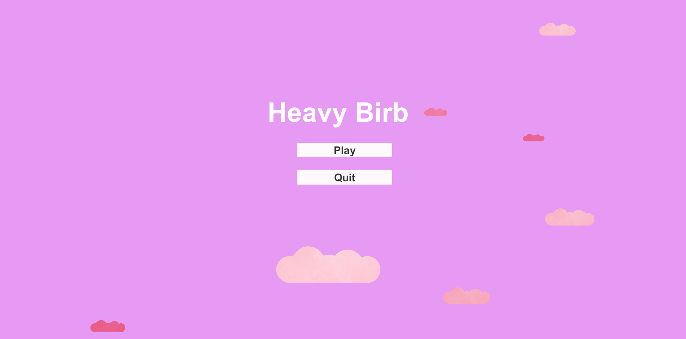
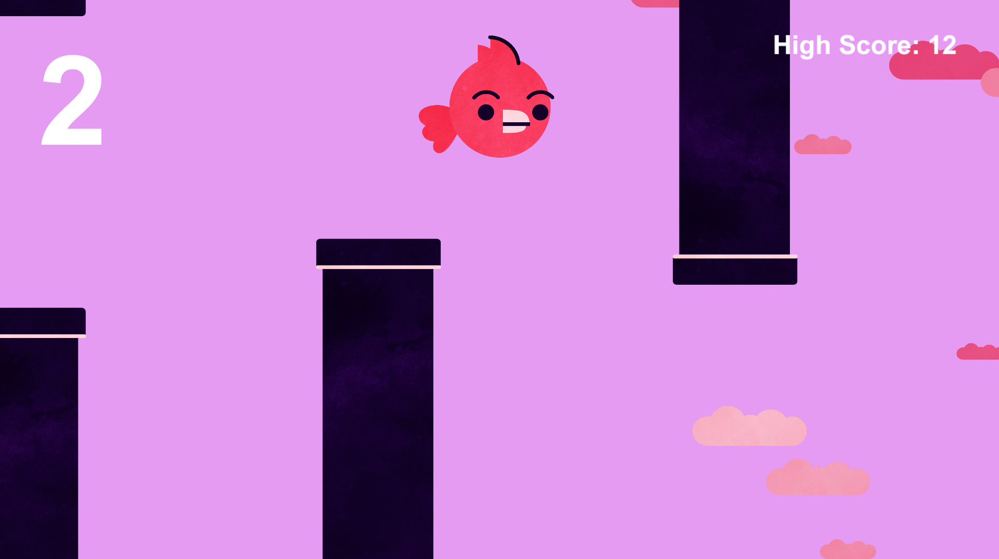
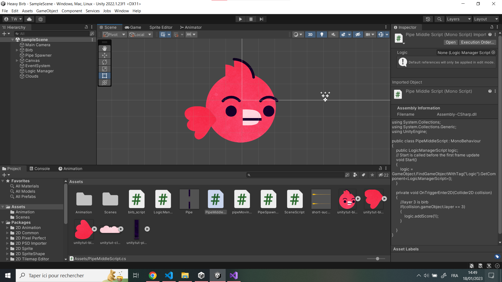
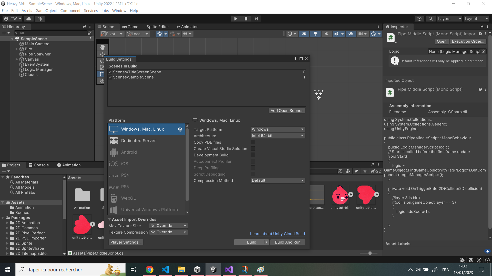

# Heavy Birb
### Clone of flappy bird, made with [this tutorial](https://youtube.com/watch?v=XtQMytORBmM&si=EnSIkaIECMiOmarE)

## How to play ?

1. Download the code
2. Import the code on Unity
3. Files -> Build Settings (choose your platform) -> Build
4. Open the .exe file

*Works on Windows, Mac and Linux*